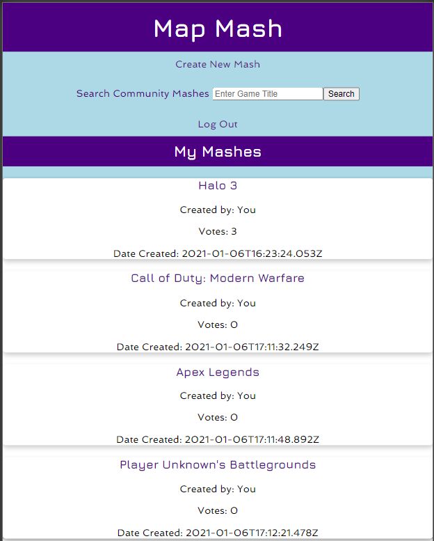
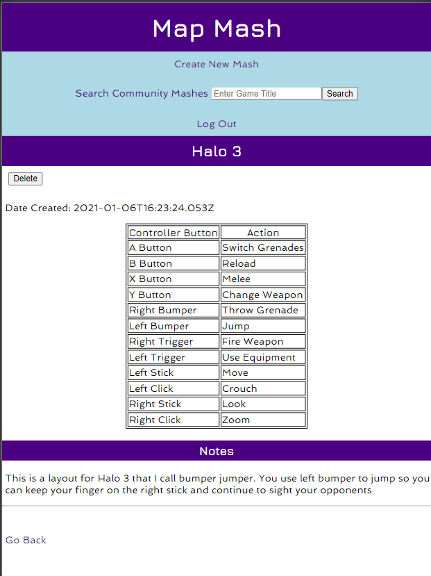
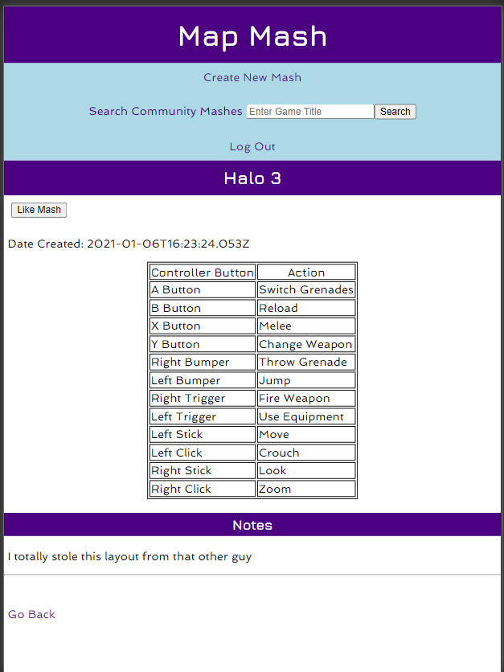
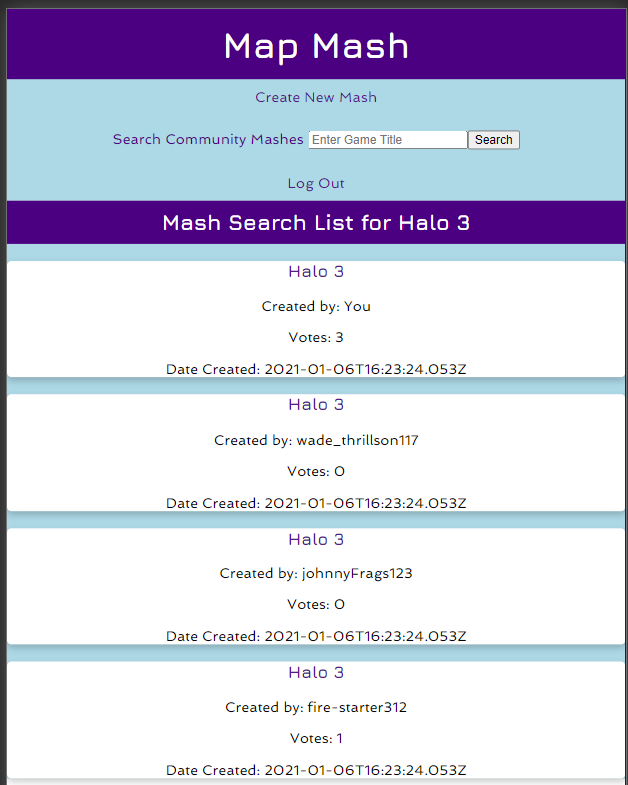

# Map Mash API

Front End Link: https://map-mash.netlify.app

## This is the API for the Map Mash Client

This is the Map Mash Client, which is an application that allows users to create their custom controller button configurations (Mashes) for their favorite video games. The mash cards for these mashes will appear on the homepage. The game titles may be clicked to reveal the mash with a button/action table and the notes.

The user is required to enter a game title, and they may enter an action for each button on the controller. Any action left blank will be assigned the string 'Not Used'. The user may also enter any notes about their Mash they want to make. The user may also delete a mash.

Users may also enter a game title in the search input in the nav which will render a search list of all mash cards for that title by any user. Once again, users may click on the game title to see the mash. If a user clicks on another user's mash, the delte button is replaced with a like button, where you may 'like' mashes posted by other users. Users may only like the mash of another user one time. You can click the Map Mash header at the top of the page to redirect to the home page at any time while you are logged in.

This is a Full Stack PERN application. This is the server side of the application which utilizes Express, Node.js and PostgreSQL

api/mashes - This will allow you to GET and POST Mashes which consist of the Game title, the date created, and your Mash notes

api/:mash_id - This will allow you to GET a Mash ID or DELETE a Mash by ID

api/binds - This will allow you to GET and POST Binds which are the button input and action value pairs that exist in your Mashes

api/:bind_id - This will allow you to GET a Bind ID or DELETE a Bind by ID

